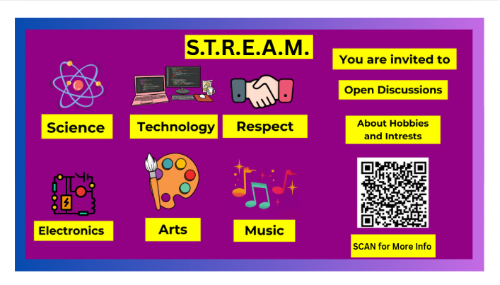

-----
 -----
## **Understanding S.T.R.E.A.M.: An Interconnected Approach to Knowledge**
S.T.R.E.A.M. is an acronym that encapsulates a holistic educational framework incorporating **Science**, **Technology**, **Respect**, **Electronics**, **Art**, and **Music**. Each element plays a crucial role in shaping well-rounded individuals equipped with the skills necessary for the challenges of the modern world. This essay explores each component in detail and demonstrates how they inter-relate to foster a comprehensive learning environment.

-----
## **Science**
**Science** is the foundation of S.T.R.E.A.M., providing methodologies for inquiry and experimentation. It encourages critical thinking, observation, and the systematic study of the natural world. Scientific literacy enables students to understand scientific principles and apply them to real-world problems, such as climate change and disease control. Scientific advancements, from medical breakthroughs to renewable energy technologies, require a solid understanding of scientific concepts.

Moreover, science often overlaps with technology in areas such as engineering and environmental science. For example, biologists study ecosystems, while engineers design technologies that minimize environmental impact, demonstrating the synergy between these fields.

-----
## **Technology**
**Technology** refers to the tools and systems developed through scientific knowledge to solve problems and enhance human life. It encompasses everything from simple machines to complex software systems. As technology constantly evolves, it affects every aspect of life, including how we communicate, learn, and even create art.

In the realm of education, technology facilitates innovative learning experiences. Online platforms, coding languages, and technological applications make complex scientific and mathematical concepts more accessible. The synergy between technology and science becomes evident, as technological advancements often stem from scientific discoveries.

-----
## **Respect**
**Respect** serves as the ethical backbone of the S.T.R.E.A.M. framework. It encourages students to appreciate diverse perspectives, ideas, and cultures. A respectful learning environment fosters collaboration, creativity, and open dialogue, allowing students to express themselves freely and build empathy for others.

In professions where science and technology play a key role, respecting ethical standards becomes crucial. For instance, scientists and technologists must consider the implications of their work on society and the environment. By incorporating respect into the learning process, students become responsible citizens who can navigate the complexities of modern challenges with integrity.

-----
## **Electronics**
**Electronics** brings together the principles of science and technology to create devices that perform specific functions. From smartphones to robotics, electronics blend scientific theories with practical application. This field has revolutionized communication, entertainment, and healthcare, enhancing the quality of life globally.

Studying electronics requires a strong background in both science and technology, making it an excellent bridge between the two. Students engaged in building electronic projects not only learn about circuitry and programming but also develop problem-solving skills that are transferable to various fields.

-----
## **Art**
**Art** is a vital pillar of S.T.R.E.A.M., showcasing creativity and expression. It encompasses various forms, such as visual arts, music, and literature. Art encourages individuals to think outside the box, fostering innovation and imagination.

The relationship between art and technology is particularly significant in the digital age, where tools like graphic design software and digital media have transformed how artists create and share their work. Moreover, the integration of art into science and technology can lead to projects that communicate complex ideas more effectively.

-----
## **Music**
**Music** plays a crucial role in the S.T.R.E.A.M. framework by enhancing creativity and emotional expression. It fosters collaboration and teamwork, especially in ensemble settings. Learning music involves understanding patterns and structures, which can also relate to mathematical concepts and scientific principles.

Music technology, such as digital audio workstations and software for sound editing, further emphasizes the connection between music and technology. These tools allow artists to innovate and reach wider audiences, bridging the gap between artistic expression and technological advancement.

-----
## **Interconnection of S.T.R.E.A.M. Elements**
The true power of the S.T.R.E.A.M. framework lies in its interconnectedness. Each element enhances and complements the others, creating a holistic educational experience. For example:

- **Scientific knowledge** informs **technological development**, which can be used to create innovative **electronic** devices that effectively communicate artistic ideas.
- Incorporating **art** and **music** into scientific presentations enhances engagement and understanding, while **respect** for diverse perspectives can inspire collaboration on groundbreaking projects.
- The ethical implications of **technology** and **electronics** can be better navigated within a framework that includes **respect**, ensuring that advancements benefit all members of society.

By fostering these interconnections, educators can cultivate a learning environment that equips students with the skills, knowledge, and attitudes necessary for personal and professional success.

-----
# **S.T.R.E.A.M.**
## **S.T.R.E.A.M. Overview**
- [What is S.T.R.E.A.M.?](https://jimf99.github.io/stream/)
- [Respect in S.T.R.E.A.M.](https://jimf99.github.io/stream/respect)
- R.E.S.P.E.C.T. (Respect is important, for a better World/Universe)
-----
## **Science + Technology**
### **Astronomy**
- [Astronomy](https://en.wikipedia.org/wiki/Astronomy)
### **Anthropology + Archaeology**
- [Antrhopology](https://en.wikipedia.org/wiki/Anthropology)
- [Archaeology](https://en.wikipedia.org/wiki/Archaeology)
### **Amateur Radio**
- [Practice Morse Code](https://www.tinkercad.com/things/5j9R1J0DAa9-morse-decode-encode)
- [MorseDuino - Budd Churchward](http://wb7fhc.com/store/p1/Morseduino_2_CW_Decoder_Kit.html)
- [Budd Churchward - Website](http://wb7fhc.com/index.html)
### **Artificial Intelligence**
- [University of Alberta's Research in Artificial Intelligence](https://www.ualberta.ca/en/research/our-research/artificial-intelligence.html)
- [Google Search: Wonder Valley AI Data Centre Park](https://www.google.com/search?q=Wonder+Valley+AI+Data+Centre+Park)
- [VoyageDallas Interview with Anil Pantangi](https://voyagedallas.com/interview/daily-inspiration-meet-anil-pantangi/)
- [Microsoft Blog: The Transformative Impact of AI on Telecommunications](https://www.microsoft.com/en-us/industry/blog/telecommunications/2025/04/08/the-transformative-impact-of-ai-and-generative-ai-on-oss-and-bss-in-telecommunications/)
### **Gaming & Psychology of Gaming**
- [The 4 Keys to Fun by Nicole Lazzaro](https://nicolelazzaro.com/wp-content/uploads/2012/03/4_keys_poster3.jpg)
### **Other Tech**
- [The SOL-20 Computer](https://oldcomputers.net/sol-20.html)
- [Tom Igoe's GitHub](https://github.com/tigoe)
- [GoBASIC Programming](https://gotbasic.com/)
- [Interview with Forrest M. Mims III (Part 1)](https://www.youtube.com/watch?v=hUlzdFSNMkk)
- [Audio from 20Hz to 20Khz](https://www.youtube.com/watch?v=qNf9nzvnd1k)
-----
## **Respect + Friendships**
- [Respect in S.T.R.E.A.M.](https://jimf99.github.io/stream/respect)
- [Agape Language Centre](https://agapelanguagecentre.com/)
-----
## **Electronics + Circuits**
- [How Transistors Work](https://www.build-electronic-circuits.com/how-transistors-work/)
- [One Transistor Amplifier Tutorial (Video)](https://youtu.be/Kk12KHVget4?si=PUNHuauTdFuU6RJi)
- [Another One Transistor Amplifier Tutorial (Video)](https://youtu.be/QGInwQa_XEM?si=X-0im91_P1cmVopg)
- [How to Make a Simple Amplifier Circuit Without IC](https://www.instructables.com/How-to-Make-Simple-Amplifier-Circuit-Without-IC/)
- [Recreating the NTE1431 IC](https://www.youtube.com/watch?v=44a01ao-NuQ)
- [Simple FM Transmitter](https://www.build-electronic-circuits.com/simple-fm-transmitter/)
- [Anas Kuzechie's Projects Blog](https://akuzechie.blogspot.com/)
- [Anas Kuzechie's YouTube Playlists](https://www.youtube.com/@AnasKuzechie/playlists)
- [TM1638-MQTT GitHub Project](https://github.com/Resinchem/TM1638-MQTT/tree/main?tab=readme-ov-file)
- [TM1638 Demonstration Video](https://www.youtube.com/watch?v=KxfhVqne1Qs)
- [Another TM1638 Demonstration Video](https://www.youtube.com/watch?v=XhUMp5aGGqI)
-----
## **Electronics + Computers**
### **Books / Authors**
- **Forrest M. Mims III**
  - [Search Google for 'Make: Maverick Scientist: My Adventures as an Amateur Scientist'](https://www.google.com/search?q=Make%3A+Maverick+Scientist%3A+My+Adventures+as+an+Amateur+Scientist)
  - [Google Books: Make: Maverick Scientist](https://www.google.ca/books/edition/Make_Maverick_Scientist/UUoCEQAAQBAJ?hl=en&gbpv=1&printsec=frontcover)
  - [Publications by Forrest M. Mims III](http://www.forrestmims.org/publications.html)
  - [Forrest M. Mims III's Author Page on MakeZine.com](https://makezine.com/author/forrest-m-mims-iii)
### **Arduino and Other Stuff**
- [ADCTouch Arduino Library](https://github.com/martin2250/ADCTouch)
- [Arduino Official Website](https://arduino.cc/)
- [Arduino Built-in Examples](https://docs.arduino.cc/built-in-examples/)
- [Arduino Tutorial Video by FreeCodeCamp](https://www.youtube.com/watch?v=DPqiIzK97K0)
- [Makeability Lab on GitHub](https://github.com/makeabilitylab)
- [University of Washington's Paul G. Allen School of Computer Science](https://cs.washington.edu/)
- [How a Theremin Works](https://electronics.howstuffworks.com/gadgets/audio-music/theremin.htm)
- [Open Theremin Pproject](https://github.com/GaudiLabs/OpenThereminV4)
- [Theremix - Virtual Theremin App](https://theremin.app/)
- [DIY Arduino Theremin Project](https://projecthub.arduino.cc/tdelatorre/theremino-a-theremin-made-with-arduino-3e661f)
- [Makezine's Modern Day Internet Telegraph Project](https://makezine.com/projects/use-raspberry-pi-modern-day-telegraph/)
- [Random Nerd Tutorials for Arduinos](https://randomnerdtutorials.com/)
- [ELEGOO Arduino Super Starter Kit Tutorials Playlist](https://youtube.com/playlist?list=PLWdhcCYoOsiJE1DS7OhPfwrHrGlUED6Az)
- [Arduino LCD + Keypad Shield Games on GitHub](https://github.com/dadecoza/arduino-lcd-keypad-shield-games)
- [Arduino TFT eSPI TouchScreen](https://wokwi.com/projects/327361970806194770)
- [TouchGUI Oscillator P5.js Sketch](https://editor.p5js.org/jimf99/sketches/MdV3NQO_E)
- [P5.js WebSerial Sketch by Cacheflowe](https://editor.p5js.org/cacheflowe/sketches/F7GG8vuEy)
- [Arduino LCD Shield Games Video](https://www.youtube.com/watch?v=ShZsyHIK6DI)
- [Dabble App Gamepad Module for ESP32/Bluetooth](https://ai.thestempedia.com/docs/dabble-app/gamepad-module/)
- [Arduino Starter Kit Projects Video Overview](https://www.youtube.com/watch?v=0pESLpvpR00)
- [Arduino Theremin with Speaker and Tone Wokwi Project](https://wokwi.com/projects/394183708556652545)
- [MIDI Controller Wokwi Project](https://wokwi.com/projects/387845479260121089)
- [Solar Li-ion Battery Charger DIY Video](https://www.youtube.com/watch?v=NaxtGdHR_6E)
- [Full Documentary on the Transistor](https://www.youtube.com/watch?v=U4XknGqr3Bo)
- [American Experience: Silicon Valley Documentary](https://www.youtube.com/watch?v=3AtcFHIY4Pw)
- [Open Sound Control (OSC) Arduino Library](https://www.arduinolibraries.info/libraries/osc)
- [Notes and Volts Blog](https://www.notesandvolts.com/)
- [Sketch by Kenzo](https://editor.p5js.org/kenzo/sketches/Bk6Xa7Kgg)
- [DIY Theremin Build - Noisette](https://www.youtube.com/watch?v=rqtBb37QE2M)
- [Arduino 1d Pong](https://www.instructables.com/Arduino-LED-Pong-Game-a-Fun-Electronics-Project/)
### **James Lewis**
- [BaldCorder Tricorder Project Video](https://www.youtube.com/watch?v=ri2RpTgju-Y&t=766s)
-----
## **Electronics + Robotics**
- [Colin Mitchell's Electronics Projects at TalkingElectronics](https://www.talkingelectronics.com/projects/200TrCcts/200TrCcts.html)
- [Bluepad32 Arduino Bluetooth Controller Library](https://github.com/ricardoquesada/bluepad32-arduino)
- [TB6612FNG Motor Driver Wokwi Project](https://wokwi.com/projects/410323062531374081)
- [TM1638lite GitHub Project](https://github.com/danja/TM1638lite)
-----
## **Arts**
- [How to Make a Paper Box Video](https://www.youtube.com/watch?v=YMSxv2JDFt0)
- [P5.js Creative Coding Tutorials for Beginners Playlist](https://www.youtube.com/watch?v=x1NxkEjfNtI&list=PL0beHPVMklwgMz4Z-mNp4_udo9mjBk7pn)
-----
## **Music**
- [Sonic Pi: The Live Coding Music Synth](https://sonic-pi.net/)
- [DIY Synths](https://github.com/Atarity/diy-synths)
- [Over The Rainbow Piano Tutorial](https://www.youtube.com/watch?v=tVNCJcWyjbc)
- [P5.js Touch Events Sketch by Ben Grosser](https://editor.p5js.org/bengrosser/sketches/GYPSrhPZe)
- [Neo-Chord DIY MIDI Controller](https://www.instructables.com/Neo-Chord-DIY-MIDI-Controller-for-Playing-Chords/)
- [MIDI.city: Web MIDI](https://midi.city/)
- [MIDI.js Javascript Library](https://github.com/mudcube/MIDI.js)
- [Chrome Music Experiments](https://musiclab.chromeexperiments.com/Experiments)
- [Google's Scan Sequencer Experiment](https://experiments.withgoogle.com/scan-sequencer)
- [Google's Instrument Playground Experiment](https://experiments.withgoogle.com/instrument-playground)
- [Theremin World](http://thereminworld.com/)
- [Open Theremin Kit](https://www.gaudi.ch/OpenTheremin/)
- [Theremix Virtual Theremin App](https://github.com/yeemachine/theremix)
- [Sound Basics by Carleton College](https://people.carleton.edu/~jellinge/m101s12/Pages/01/01SoundBasics.html)
- [Karaoke Playlists on YouTube](https://www.youtube.com/@karafun/playlists)
- [Fun Karaoke Video](https://www.youtube.com/watch?v=sdQWAFtgIB4)
- [Stingray 3 Hours Karaoke Playlist](https://www.youtube.com/watch?v=WiVuYFXiS14&list=PLD3E5F3350EEDE7F6&index=1)
- [P5.js Synth Sketch by JeanTim](https://editor.p5js.org/JeanTim/sketches/3Pfg4_C6r)
- [Notes and Volts Blog](https://www.notesandvolts.com/)
- [Web MIDI JS Library](https://webmidijs.org/)
### **Music Projects**
- [DIY Theremin Project Video](https://www.youtube.com/watch?v=oRhO0MJIl58)
- [Arduino MIDI Theremin Video](https://www.youtube.com/watch?v=CWPtxGrBlU8)
- [ThereMino (Arduino Theremin)](https://projecthub.arduino.cc/tdelatorre/theremino-a-theremin-made-with-arduino-3e661f)
- [NerdMusician YouTube Playlists (MIDI Projects)](https://www.youtube.com/@NerdMusician/playlists)
- [Project: I Built a MIDI Theremin](https://www.musiconerd.com/i-built-a-midi-theremin/)
- [UkeBuddy: Learn Ukulele](https://ukebuddy.com/)
- [Ukulele Video Tutorial](https://www.youtube.com/watch?v=FGpwXq9Kbhk)
- [Ukulele Video Tutorial](https://www.youtube.com/watch?v=kVpv8-5XWOI)
- [Chordify: Hey Soul Sister Chords](https://chordify.net/chords/train-songs/hey-soul-sister-chords)
- [DIY Basic Ukulele MIDI Controller Video](https://www.youtube.com/watch?v=tW2iFr9qjI0)
- [DIY Advanced Bass Guitar MIDI Controller Video](https://www.youtube.com/watch?v=0U1bAcWDPBI)
- [DIY Wireless MIDI Controllers Video](https://www.youtube.com/watch?v=zFWH0xxBsnQ)
-----
## **Culture - Beliefs - First Nations**
- [First Nations Creation Myths](https://google.com/?q=first+nations+creation+myths)
- [Orange Shirt Day - Every Child Matters](https://www.savethechildren.ca/every-child-matters-the-origin-of-orange-shirt-day/)
  ## **Culture - Beliefs**
- [Christianity on Wikipedia](https://en.wikipedia.org/wiki/Christianity)
- [Judaism on Wikipedia](https://en.wikipedia.org/wiki/Judaism)
- [Islam on Wikipedia](https://en.wikipedia.org/wiki/Islam)
- [The Clear Quran (English Translation)](https://www.clearquran.com/downloads/quran-english-translation-clearquran-edition-allah.pdf)
-----
## **Library**
- [Calgary Library Papercut Portal](https://papercut.calgarylibrary.ca/user)
-----
## **Utils**
- [Markdown to PDF Converter](https://apitemplate.io/pdf-tools/convert-markdown-to-pdf/)
-----
## **Temp Notes**
- [P5.js Mobile Device Movement Example](https://p5js.org/examples/animation-and-variables-mobile-device-movement/)
- [OpenProcessing Sketch by Cacheflowe](https://openprocessing.org/sketch/422944)
- [OpenProcessing Sketch](https://openprocessing.org/sketch/1200514)
- [P5.js Sketch by jimf99](https://editor.p5js.org/jimf99/sketches/XiDUFJO5p)
- [P5.js Sketch by jimf99](https://editor.p5js.org/jimf99/sketches/hDv2gmcI5)
- [P5.js Sketch by jimf99](https://editor.p5js.org/jimf99/sketches/MdV3NQO_E)
-----
## **Projects**
- [9cansPoC HTML](https://jimf99.github.io/9cansPoC.html)
- [9CansPoC_1](https://jimf99.github.io/9CansPoC_1/index.html)
- [Racer-1a](https://jimf99.github.io/racer-1a/index.html)
- [Racer-1b](https://jimf99.github.io/racer-1b/index.html)

(CopyLeft 2025) 
